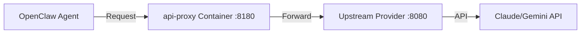

# API Proxy (Luna API Proxy)

[](https://github.com/carlnoah6/api-proxy/actions/workflows/ci.yml)
[](https://github.com/carlnoah6/api-proxy/actions/workflows/deploy.yml)

> **Status**: ✅ Running in production (Docker)
> **Port**: 8180

API Proxy is a FastAPI application that acts as a middleware between OpenClaw and upstream LLM providers. It handles authentication, usage tracking, and smart model fallback.

## Architecture

The system is deployed as a Docker container, sitting between the main OpenClaw agent and the upstream provider (e.g., a local LLM runner or another proxy).



**Key Features:**
- **API Key Authentication**: Independent usage tracking per key.
- **Smart Fallback**: Monitors upstream model quotas and auto-switches when limits are reached.
- **Usage Statistics**: Tracks token usage by key, day, hour, and model.
- **Format Conversion**: Handles Anthropic/OpenAI format differences.

> **Note**: Webhook handling has been migrated to `webhook-gateway`. This service no longer processes raw webhooks.

## Deployment (Docker)

The service is deployed using Docker Compose.

### 1. Start / Update

```bash
# Pull latest image and start in background
docker compose pull && docker compose up -d
```

### 2. View Logs

```bash
# Follow container logs
docker compose logs -f
```

### 3. Configuration

Configuration is managed via `docker-compose.yml`, environment variables, and mounted JSON files.

**Environment Variables:**

| Variable | Default | Description |
|----------|---------|-------------|
| `UPSTREAM_URL` | `http://host.docker.internal:8080` | URL of the upstream LLM provider |
| `KEYS_FILE` | `/app/keys.json` | Path to the keys file inside container |
| `FALLBACK_CONFIG` | `/app/fallback.json` | Path to fallback config inside container |

**Volumes:**

- `./keys.json` -> `/app/keys.json` (Read/Write): Stores API keys and usage data.
- `./fallback.json` -> `/app/fallback.json` (Read-Only): Defines fallback chains.

## Development

### Local Testing

To run tests locally:

```bash
# Install dependencies
pip install -r requirements.txt

# Run tests
pytest
```

### Code Structure (`src/`)

- `app.py`: Main FastAPI entrypoint and route definitions.
- `auth.py`: API key validation and management.
- `proxy.py`: Request forwarding and response handling.
- `fallback.py`: Logic for switching models upon failure/quota limits.
- `usage.py`: Usage tracking and statistics recording.
- `health.py`: Upstream health checks.
- `config.py`: Configuration loading.

## API Documentation

### Admin Endpoints

Manage keys and view statistics via HTTP requests. Requires the Admin API Key.

**Base URL**: `http://localhost:8180`

```bash
export ADMIN_KEY="sk-admin-luna2026"

# Check Fallback Status (Model availability & quotas)
curl -s -H "x-api-key: $ADMIN_KEY" http://localhost:8180/admin/fallback

# View Daily Usage (Breakdown by model)
curl -s -H "x-api-key: $ADMIN_KEY" http://localhost:8180/admin/usage/daily

# List All Keys
curl -s -H "x-api-key: $ADMIN_KEY" http://localhost:8180/admin/keys

# Create New Key
curl -X POST -H "x-api-key: $ADMIN_KEY" -H "Content-Type: application/json" \
  -d '{"name": "NewUser"}' http://localhost:8180/admin/keys

# Disable a Key
curl -X POST -H "x-api-key: $ADMIN_KEY" http://localhost:8180/admin/keys/<api_key>/disable
```

### Health Check

```bash
# Service health
curl http://localhost:8180/health
```
